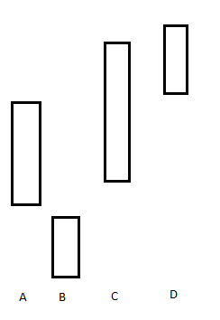
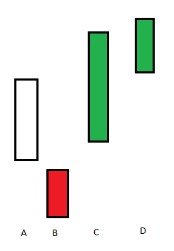
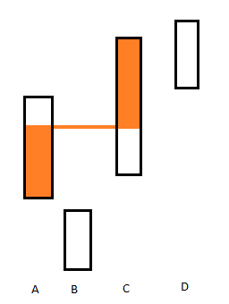
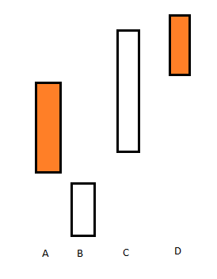

### Table of contents

- [Automatic traders](#automatic-traders)
  - [Arbitrager bot](#arbitrager-bot)
    - [In detail](#in-detail)
    - [Some adaptations](#some-adaptations)
  - [Bot (Andrea Ballarini)](#bot-andrea-ballarini)
- [GUIs](#guis)
  - [Manual TSE trader (Federico Brancasi)](#manual-tse-trader-federico-brancasi)
  - [TSE gui for auto traders (Patrick Cerka)](#tse-gui-for-auto-traders-patrick-cerka)

# Automatic traders
Advanced Programming Project Trader

## Arbitrager bot
Its goal is to maximize only EUR through arbitrage over USD, YEN, YUAN, and over all three markets

An arbitrage is done selling EUR in a market and rebuy as much as possible in another market. 

An arbitrage is skipped if can't be profit, or sell_market doesn't have enough good, or buy price is "not enough realistic".

### In detail
Assumption: For price I mean spot price (e.g. if 2 EUR corresponds to 1 USD, then USD/EUR=2/1=2)
For each pair or market, and for each good (not EUR) it compute the profit gained from 1 arbitrage.
Then if the maximum profit is > 0, it execute the corresponding arbitrage.
Let's see how a profit can be computed:

Let's say that im looking to buy (the good bought is not important here) from the market A, I will now compare 3 market where I can sell (B, C and D).

1. Step 1

    First of all I need to know (only for the buy_market) the maximum quantity in EUR I can send to the buy_market (in the code is called "max_eur_to_send"), I will use the function get_buy_price, but only need to specify the quantity of good that I'm looking for, so I start requesting an infite quantity, then the market will tell me the maximum quantity to request, and recall the function again until the eur to be sent are more than the ones I have, and every time I divide by 2 the quantity. The quantity of good is called "max_alt_to_receive" (alt means altcoin, aka good).

2. Step 2

    I will define for each market 2 variables: min_price and max_price.

    ONLY in the case of the buy_market the first is defined as the current price EUR/good and the second as the price expected after bought "max_alt_to_receive".

    In the case of sell_market is the opposite, so max_price is the current price, and min_price is the expected price after selling "max_alt_to_receive".
    It is computed easily because we call get_sell_price passing "max_alt_to_receive".

3. Step 3

    To continue we need some assumptions:
    - The quantity received increasy linearly when we increase the quantity send for the buy_market, and decrease linearly when selling for sell_market.
    - max_price can't be lower the min_price (this case is handled skipping the trade)

    Let's see starting from analyzing why B is skipped as sell_market:

    

    If the sell_max_price is lower or equal than buy_min_price can't be profit, so only C and D (theoretically) can be profitable

    Now imagine that we have a parameter x (0<=x<=1) which is how much of the "max_eur_to_send" we will actually send.
    For example if x is 0.5, then the price after the trade correspond to Average(min_price, max_price) for each market.

    In the case of C we see that we shouldn't sell all the "max_eur_to_send" quantity, because after the orange line is no longer profitable, if you don't understand imagine like starting with x=0, and increase it gradually, and try to visualize the 2 actual "prices after the trade" for A and C (note that if x=1, both the rectangles become full filled by orange).

    Increasing by x these 2 prices will be equal at some point, the corresponding x, if multiplied by "max_eur_to_send", is the the eur to send to make the maximum profit, then we aproximate by default the quantity requested when sending x*"max_eur_to_send", and use it to compute the profit after calling get_sell_price with that quantity.

    

    If sell_min_price is greater or equal than buy_max_price we can have a problem with the previous computations, but we are lucky because we can send all the "max_eur_to_send" quantity (Or we can say that we set x as 1).

    

4. Step 4
    Given the market pair, good, quantity of good to request and quantity of eur to send; which can maximize the profit, we will execute that trade.

### Some adaptations
In the case of buy_market max_price is lower than min_price, then max_price=min_price, the opposite in the case of sell_market, if this occours is an exploitation of the market. buy_market and sell_market in a trade could be the same, if this, is another exploitation.
It can be returned also a rest of good along with the EUR good, because in the first trade there can be the possibility that the goods or prices in the sell_market could change, so it tries to sell all goods at the maximum price as possible, and return the rest.

## Bot (Andrea Ballarini)
It's similar to the first arbitrage strategy, but a little customized.

1. Compute the for each market the "aproximize" buy price and sell price.
2. Compute the 2 averages: one between all buy prices, and one between all sell prices
3. For each good kind:
   1. Buy a good sending 1/3 of the initial eur quantity on a market below the buy price average (preferably bfb)
   2. Sell 1/3 of the good received on a market upon the sell price average
4. Give back all the goods that has

# GUIs

## Manual TSE trader (Federico Brancasi)
The GUI is used to manually trade on the markets. It allows to buy and sell goods on the markets, and to see the current market prices.
It also displays the suggestions of the best trades.
## TSE gui for auto traders (Patrick Cerka)
The "Bot_side", contrary to what "User_side" does, gives you the complete power and strategy of the 2 TSE trader bot by only giving the quantity of how many trades you wanna do. 
What's the diff between the 2 traders? 

In short, the first bot, safe mode, is programmed to make safe moves, thus by not risking too much. This let's you earn some money without having to risk it all.
The second bot, arbitrager aka unsafe mode, is made for anyone who likes to risk it all, but also granting really big gainings if succeding in the "bet". Gamble!

Talking about the graphics, the windows is made 4 label, disposed in rows: 
-The first one with the 2 buttons used for selecting which bot mode you wanna use (safe or unsafe), with the last label being the indicator of which bot is selected at the moment;
-The second one is made of 3 columns, each one for each market choosed by us (BFB,PARSE and SOL), each one respectively made of a title indicating which market is and a field where you can see the trade logs for every market;
-The third one is used for selecting how much trades and is made of a slider from 0 to a 100, two buttons to also select how many trades you want and a "ENTER" button, used obviously for committing this value.

This it all. Enjoy using our trader bot!!